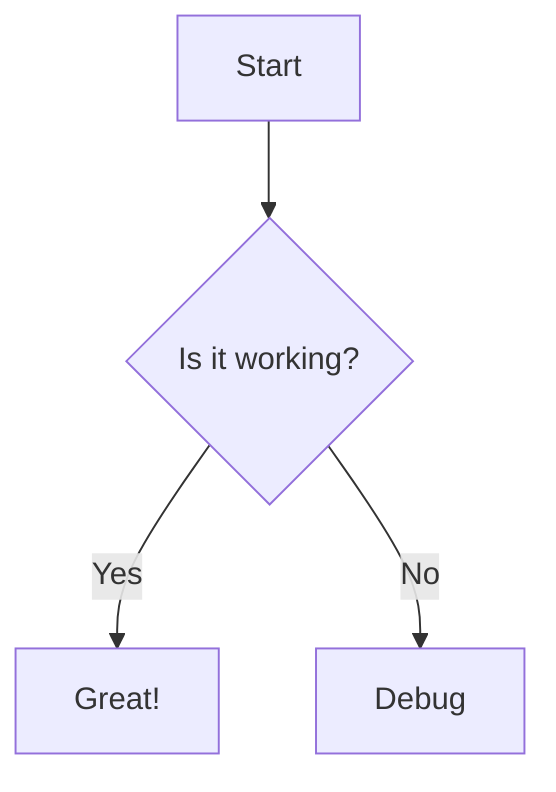

# Hermit-V2 — *The Minimal Hugo Theme*

Hermit-V2 is a minimal, fast, and actively maintained Hugo theme built for bloggers who want a clean, focused website. It is a maintained fork of [Hermit](https://github.com/Track3/hermit), extending the original with bug fixes, modern Hugo compatibility, and a steady stream of new features — whilst staying true to its minimal roots.

[](https://1bl4z3r.github.io/hermit-V2)

[](https://opensource.org/licenses/MIT)

## Demo & Documentation

**Live demo:** <https://1bl4z3r.github.io/hermit-V2>

The demo site doubles as the theme's full documentation — every feature is showcased there. Its source lives in the [staging branch](https://github.com/1bl4z3r/hermit-V2/tree/staging).

[](https://1bl4z3r.github.io/hermit-V2)


## Requirements

- **Hugo Extended** `v0.146.0` or later is required.

  - **Upgrading from an older version?** Hugo `0.146.0` introduced a new flat layout system — `_default` is removed, `partials` is renamed to `_partials`, and `shortcodes` to `_shortcodes`. If you have customised any layout files in your site root, you will need to rename those directories accordingly. See the [full migration overview](https://gohugo.io/templates/new-templatesystem-overview/) from the Hugo team.

  - **Debian users:** the Debian repositories may still carry an older Hugo binary. You will need to grab the `v0.146.0`+ binary directly from the [Hugo releases page](https://github.com/gohugoio/hugo/releases).


## Installation

> If you don't have a Hugo site yet, create one first:
> ```bash
> hugo new site myblog
> cd myblog
> git init
> ```
> Then proceed with adding the theme below.

Run the following from the root of your Hugo site:

```bash
git clone https://github.com/1bl4z3r/hermit-V2 themes/hermit-v2
```

If your site is already a Git repository, using a submodule makes future updates much simpler:

```bash
git submodule add -b main https://github.com/1bl4z3r/hermit-V2 themes/hermit-v2
```

To pull the latest version at any time:

```bash
git submodule update --remote
```

Then set the theme in your `hugo.toml`:

```toml
theme = "hermit-v2"
```

### Previewing locally

Start the local development server with:
```bash
hugo server -D
```

Your site will be available at `http://localhost:1313`. The `-D` flag includes posts marked
`draft: true` so you can preview content before publishing it.

When you're happy and ready to build for production, run:
```bash
hugo
```

The generated site will be output to the `public/` directory. For hosting and deployment options,
see the [Hugo deployment docs](https://gohugo.io/hosting-and-deployment/).

## Configuration

All site configuration lives in `hugo.toml` (or `hugo.yaml`) in the root of your Hugo project. A fully annotated example is available at [`hugo.toml.example`](https://github.com/1bl4z3r/hermit-V2/blob/main/hugo.toml.example). For a detailed walkthrough of every option, see [Explaining Configs](https://1bl4z3r.github.io/hermit-V2/en/posts/explaining-configs/).

A minimal starting configuration looks like this:

```toml
baseURL        = "https://example.com/"
defaultContentLanguage = "en"
defaultContentLanguageInSubdir = true
theme          = "hermit-v2"
enableRobotsTXT = true

[params]
  homeSubtitle     = "Just a humble blogger."
  readTime         = true
  code_copy_button = true
  scrollToTop      = true
  shareSocial      = true
```
> **Multilingual sites only:** `defaultContentLanguage` and `defaultContentLanguageInSubdir = true` are only needed if you are running a multilingual site. 
> With `defaultContentLanguageInSubdir = true` set, your site will be served from `/en/` (or whichever language code you set), so visiting `http://localhost:1313` will redirect you there automatically.


> If you are running a **single-language site**, remove these two lines and your site will serve from `/` as expected:
> ```toml
> # Remove these if your site is single-language
> defaultContentLanguage = "en"
> defaultContentLanguageInSubdir = true
> ```

### Navigation Menu

Menu items in the top navigation bar are configured in `hugo.toml` under `[[menus.main]]`. Each entry needs a `name`, a `url`, and a `weight` (which controls display order — lower numbers appear first):
```toml
[[menus.main]]
  name   = "Posts"
  url    = "/posts/"
  weight = 10

[[menus.main]]
  name   = "About"
  url    = "/about/"
  weight = 20
```

The URLs should match the path where that content lives under your `content/` directory.

## Core Features

These have been part of the theme since the original Hermit and remain front and centre.

- Single-column layout with carefully crafted typography for a great reading experience
- Navigation bar that hides as you scroll down — and reappears when you reach the end of a page
- Featured image support, displayed as a dimmed full-page background
- All posts displayed on a single page, grouped by year
- Extremely lightweight — no third-party frameworks, no unnecessary code
- Syntax highlighting and one-click code copying on all code blocks
- Responsive and retina-ready, scales gracefully from desktop to the smallest phone
- LaTeX support via MathJax and diagram support via Mermaid

## Features

Hermit-V2 builds on the minimal foundation of the original Hermit theme, adding new
capabilities whilst keeping the same lean footprint. Jump to any feature below, or read
through for a full walkthrough with configuration snippets.

**Out of the box**
- [Single-column layout with focused typography](#core-features)
- [Navigation bar that hides on scroll and reappears at the bottom of a page](#core-features)
- [Posts listed on a single page, grouped by year](#core-features)
- [Syntax highlighting and one-click code copying](#syntax-highlighting)
- [Responsive and retina-ready](#core-features)

**Content & Display**
- [Featured image with optional copyright notice](#featured-image)
- [Image gallery with lightbox](#image-gallery)
- [Admonition and collapsible summary call-out blocks](#admonition--summary-shortcodes)
- [Scroll to Top button](#scroll-to-top)
- [Read time estimate](#read-time)
- [Pinned posts](#pinned-posts)
- [Related posts](#related-posts)
- [Print styling per page](#print-styling)

**Writing & Formatting**
- [Markdown extended inline styles](#markdown-inline-styles)
- [Table of Contents](#table-of-contents)
- [The `figure` shortcode with automatic WebP conversion](#the-figure-shortcode)
- [LaTeX support via MathJax](#mathjax--latex-support)
- [Diagram support via Mermaid](#mermaid--diagram-support)

**Site Configuration**
- [Multi-line typewriter homepage subtitle](#multi-line-typewriter-homepage-subtitle)
- [Configurable date formats](#configurable-date-formats)
- [Colour palette and accent colour](#colour-palette--accent-colour)
- [Animations toggle](#animations)
- [Post list layout customisation](#list-layout-customisation)
- [Social sharing bar](#social-sharing)
- [Multiple authors](#multiple-authors)
- [Footer customisation](#footer-customisation)
- [robots.txt and per-page noIndex controls](#robotstxt--noindex-controls)
- [humans.txt support](#humanstxt)

**Customisation**
- [Per-page custom CSS and JS](#custom-css-and-js-per-page)
- [Site-wide SCSS overrides](#site-wide-scss-overrides)
- [Layout overrides without forking](#layout-overrides)
- [Page-specific footers](#page-specific-footers)

### Image Gallery

Embed a lightbox-style image gallery anywhere in your content using the built-in `gallery` shortcode. It supports local images (from `/assets` or `/static`) and remote URLs, generates smart-cropped 300×300 thumbnails for local images, and powers a keyboard-navigable lightbox — all with no external libraries. For a full demo, see the [Image Gallery Shortcode](https://1bl4z3r.github.io/hermit-V2/en/posts/image-gallery-shortcode/) page.

**Step 1** — Enable the gallery in `hugo.toml`:

```toml
[params.gallery]
  enable    = true
  thumbnail = "300"  # thumbnail size in px, default is 300
```

**Step 2** — List image paths (one per line) inside the shortcode in your post:

```

images/photo1.jpg
/static-images/photo2.png
https://example.com/remote-photo.jpg

```

Image path conventions:
- **`assets/` images** — use the path relative to `assets/`, e.g. `images/photo.jpg` for `/assets/images/photo.jpg`
- **`static/` images** — prefix with `/`, e.g. `/photos/photo.jpg` for `/static/photos/photo.jpg`
- **Remote images** — full `http://` or `https://` URL; thumbnails are CSS-scaled rather than server-processed

Captions are generated automatically from the filename. The gallery JavaScript is only loaded on pages where the shortcode is used. Gallery and lightbox colours can be fine-tuned via SCSS variables in `_colors.scss` — the full variable list is in the [gallery docs](https://1bl4z3r.github.io/hermit-V2/en/posts/image-gallery-shortcode/).

### Featured Image

Set a featured (background) image for any post by adding an `images` array to the front matter. Only the first URL is used as the background; all entries are also used in Open Graph and Twitter Card metadata:

```yaml

images:
  - https://picsum.photos/1024/768/?random

```

**Adding a copyright notice** — if your image requires attribution, add `ImgCopyright` to the same front matter. Any valid HTML is accepted:

```yaml

images:
  - https://picsum.photos/1024/768/?random
ImgCopyright: "By <a href='https://example.com'>Photographer Name</a>"

```

The notice colours are customisable in `_colors.scss`:

```scss
$featured-image-text:       $bright-grey !default;
$featured-image-background: rgba($arsenic, 0.45) !default;
```

See it [in action here](https://1bl4z3r.github.io/hermit-V2/en/posts/post-with-featured-image/).

### Multiple Authors

Hermit-V2 supports multiple authors on a single site. Each author can have their own bio page, and posts can attribute authorship in three ways. For a working example, see the [Michael Henderson author page](https://1bl4z3r.github.io/hermit-V2/en/michael-henderson/).

First, define the site-level fallback author in `hugo.toml`:

```toml
[author]
  name = "BLZR"
  link = "/en/about-hugo/"
```

**Scenario 1 — Author with a name and a link to their own bio page:**

```yaml

author: "Michael Henderson"
authorLink: "/en/michael-henderson/"

```

The post byline links directly to the URL provided in `authorLink`.

**Scenario 2 — Author with a name but no personal link:**

```yaml

author: "Michael Henderson"

```

The byline link falls back to the site-level author page defined in `hugo.toml`.

**Scenario 3 — No author specified in front matter:**

The site-level `[author]` values from `hugo.toml` are used entirely.

Author bio pages are regular content pages — create one at `content/<author-slug>.md` and write freely.

### Scroll to Top

A floating button that returns the reader to the top of the page — useful for long posts. The button appears after the reader has scrolled past 40% of the page and hides again when they scroll back up. For full implementation details, see [The New Scroll](https://1bl4z3r.github.io/hermit-V2/en/posts/the-new-scroll/).

**Step 1** — Enable it site-wide in `hugo.toml`:

```toml
[params]
  scrollToTop = true
```

**Step 2** — Enable it on each post where it is needed, in the front matter:

```yaml

scrolltotop: true

```

> Not every page needs this — short posts will be just fine without it.

The button icon lives in `layouts/_partials/svg.html` under the `scrollup` key, and all its styles are in `assets/scss/_scrolltotop.scss` — both are straightforward to override if you want a different look.

### Admonition & Summary Shortcodes

The `admonition` shortcode lets you add styled call-out banners to any post. Eight types are supported: `note`, `info`, `tip`, `success`, `warning`, `failure`, `danger`, and `bug`. See the [Admonition Shortcode](https://1bl4z3r.github.io/hermit-V2/en/posts/admonition-shortcode/) page for a live demo of each type.

Both `type` and `title` are optional positional parameters — `type` defaults to `note`, and `title` defaults to the type name. Markdown and HTML are both supported inside the banner body.

```

A **tip** banner — Markdown is supported inside.



A warning with no custom title.

```

The shortcode also doubles as a **collapsible summary** block using `type=summary`:

```

Details that are hidden by default until the reader expands them.

```

### Print Styling

Need a page to look polished when printed? Set `print: true` in the front matter and create a corresponding SCSS file:

**Front matter:**
```yaml

print: true

```

**File to create:** `assets/custom_css/print.scss`

Add any print-specific overrides there. The theme will only include this stylesheet on pages where `print` is enabled.

### Colour Palette & Accent Colour

The entire colour scheme is customisable. Copy [`_colors.scss`](https://github.com/1bl4z3r/hermit-V2/blob/staging/assets/scss/_colors.scss) from the theme into your own `assets/scss/` directory and edit to your liking.

For a quick accent colour without touching SCSS, use the `accentColor` param:

```toml
[params]
  accentColor = "#e83e8c"
```

### Multi-line Typewriter Homepage Subtitle

The homepage subtitle supports a typewriter animation effect, including multi-line and long-form content. Enable it in `hugo.toml`:

```toml
[params]
  homeSubtitlePrinter = true
  homeSubtitle        = "Writer. Thinker.\nSometimes both at once."
```

The `\n` character produces a line break mid-animation. Text wrapping is handled consistently across screen sizes.

### Configurable Date Formats

Date formats are defined in a nested map, giving you fine-grained control. They also ship with sensible defaults so a fresh `hugo new site` will work without any extra configuration:

```toml
[params.dateform]
  LongDate      = "Jan 2, 2006"
  ShortDate     = "Jan 2"
  NumDateShort  = "2006-01-02"
  NumDateLong   = "2006-01-02 15:04 -0700"
  CopyrightDate = "2006"
```

`CopyrightDate` controls the year format shown in the footer copyright line.

### Related Posts

Automatically surface related content at the bottom of every post:

```toml
[params]
  relatedPosts = true
```

Hugo's built-in taxonomy matching handles the rest — no extra configuration required.

### Pinned Posts

Highlight important posts at the top of your post list:

```toml
[params]
  pinned        = "Pinned"
  pinnedSVGname = "pin"
```

Then add `pinned: true` to the front matter of any post you wish to pin.

### Read Time

Display an estimated reading time on every post:

```toml
[params]
  readTime          = true
  readTimeSeparator = "·"
```

### Social Sharing

Add a social sharing bar to your posts:

```toml
[params]
  shareSocial = true
```

To customise which platforms are shown, copy `layouts/_partials/social-share.html` to your own `layouts/_partials/` and edit accordingly.

### robots.txt & noIndex Controls

Hermit-V2 gives you granular control over search engine indexing. Enable the built-in `robots.txt` template:

```toml
enableRobotsTXT = true
```

For per-page control, use front matter:

```yaml

noIndex: true
denyRobots:  "noindex, nofollow, noarchive"
allowRobots: "index, follow"

```

To disable indexing across the entire site:

```toml
[params]
  siteNoIndex = true
```

### humans.txt

To display a `humans.txt` link in the footer, either place a `humans.txt` file in your `/static` directory or define a `humans.txt` layout. The link is suppressed automatically if neither is present.

### Footer Customisation

To remove the "Made with Hugo / Theme Hermit-V2" line from the footer:

```toml
[params]
  footerHideThemeName = true
```

### Animations

Animations are enabled by default. To disable them site-wide (useful for accessibility or performance preferences):

```toml
[params]
  usesAnimation = false
```

### List Layout Customisation

Control what metadata is shown on the post list page:

```toml
[params]
  listLayout = ["description", "tags", "categories"]
```

Valid values include `description`, `tags`, `categories`, and `legacy` (which restores the original Hermit list style).

## Typography & Content Formatting

### Markdown Inline Styles

Standard Markdown inline styles work out of the box. A number of extended styles require additional Goldmark configuration in `hugo.toml`. See the [Typography page](https://1bl4z3r.github.io/hermit-V2/en/posts/typography/) for a live rendering of each.

| Syntax | Renders as | Requires config? |
|--|--|--|
| `**strong**` | **strong** | No |
| `*emphasis*` | *emphasis* | No |
| `` `code` `` | `code` | No |
| `[Link](https://example.com)` | Link | No |
| `~~strikethrough~~` | ~~strikethrough~~ | Yes |
| `++inserted text++` | inserted text | Yes |
| `==marked text==` | marked text | Yes |
| `subscript~2~text` | subscript₂text | Yes |
| `superscript^6^text` | superscript⁶text | Yes |
| `:joy:` | 😂 | `enableEmoji = true` |
| `<cite>HTML tag</cite>` | HTML tag | `unsafe = true` |

To enable the extended styles, add the following to `hugo.toml`:

```toml
enableEmoji = true

[markup]
  [markup.goldmark]
    [markup.goldmark.renderer]
      unsafe = true
    [markup.goldmark.extensions]
      strikethrough = false
      [markup.goldmark.extensions.extras]
        [markup.goldmark.extensions.extras.insert]
          enable = true
        [markup.goldmark.extensions.extras.delete]
          enable = true
        [markup.goldmark.extensions.extras.mark]
          enable = true
        [markup.goldmark.extensions.extras.subscript]
          enable = true
        [markup.goldmark.extensions.extras.superscript]
          enable = true
```

> `strikethrough` is set to `false` here to hand off rendering to the `extras.delete` extension, which handles the `~~text~~` convention more reliably.

### Table of Contents

The theme renders a Table of Contents for posts. By default it includes level 2 and level 3 headings as an unordered list. Customise this in `hugo.toml`:

```toml
[markup]
  [markup.tableOfContents]
    startLevel = 2
    endLevel   = 3
    ordered    = false
```

See the [Hugo docs](https://gohugo.io/methods/page/tableofcontents/) for the full range of options.

### Syntax Highlighting

Hermit-V2 supports three approaches to syntax highlighting.

**1. Fenced code blocks (backtick syntax)**

The standard Markdown approach — specify the language after the opening triple backtick:

````
```javascript
var sum = parseInt(num1) + parseInt(num2)
alert("Sum = " + sum)
```
````

**2. Code blocks without backticks**

Indent your code block by four spaces for plain, unhighlighted preformatted text:

```
    dt = {5:4, 1:6, 6:3}
    sorted_dt = {key: value for key, value in sorted(dt.items())}
```

**3. The `highlight` shortcode**

For fine-grained control — line numbers, line ranges, a custom starting line number — use Hugo's `highlight` shortcode:

```

.chroma .hl { display: block; width: 100%; background-color: #55595ebb }

```

To adjust the highlight line colour, edit line 5 of `assets/scss/_syntax.scss`.

### The `figure` Shortcode

Hermit-V2 extends Hugo's built-in `figure` shortcode to automatically convert local images to WebP format (with a JPG fallback), wrap them in a `<picture>` tag, and support lazy loading. For the full attribute reference and live examples, see [The Figure Shortcode](https://1bl4z3r.github.io/hermit-V2/en/posts/the-figure-shortcode/).

```

```

**Image source conventions:**

| Source | `src` format | Notes |
|--|-|-|
| `assets/` folder | `images/photo.jpg` | Hugo converts to WebP automatically |
| `static/` folder | `/images/photo.jpg` | Prefix with `/`; no WebP conversion |
| Remote URL | `https://example.com/photo.jpg` | No processing |

**Layout classes** (take effect when page width exceeds 1300px):

| Class | Behaviour |
|-|-|
| _(none)_ | Behaves like a standard Markdown image |
| `big` | Breaks out of the content column width |
| `left` | Floats image left; text wraps around it |
| `right` | Floats image right; text wraps around it |

**Mounting `static/` as an assets directory** (to enable WebP conversion for images stored in `static/`):

```toml
[[module.mounts]]
source = 'assets'
target = 'assets'

[[module.mounts]]
source = 'static/images'
target = 'assets'
```

### MathJax — LaTeX Support

LaTeX is supported via MathJax. For a full demo, see the [MathJax Support Demo](https://1bl4z3r.github.io/hermit-V2/en/posts/mathjax-support/).

**Step 1** — Enable Goldmark's passthrough extension so Hugo doesn't mangle LaTeX delimiters:

```toml
[markup]
  [markup.goldmark]
    [markup.goldmark.extensions]
      [markup.goldmark.extensions.passthrough]
        enable = true
        [markup.goldmark.extensions.passthrough.delimiters]
          block  = [['\[', '\]'], ['$$', '$$']]
          inline = [['\(', '\)']]
```

**Step 2** — Enable MathJax globally or per-page:

```toml
# Site-wide in hugo.toml
[params]
  global_mathjax = true
```

```yaml
# Per-page in front matter

mathjax: true

```

To point MathJax at your own library copy rather than the CDN default:

```toml
[params]
  mathjaxLib = "https://your-cdn.example.com/mathjax/tex-chtml.js"
```

### Mermaid — Diagram Support

Mermaid diagrams are rendered natively. Use a fenced code block with `mermaid` as the language identifier:

````

````

To point Mermaid at your own library copy rather than the CDN default:

```toml
[params]
  mermaidLib = "https://your-cdn.example.com/mermaid/mermaid.esm.min.mjs"
```

See the [Typography page](https://1bl4z3r.github.io/hermit-V2/en/posts/typography/) for a live diagram example.

## Customisation

### Custom CSS and JS (per-page)

You can load custom CSS and JS on specific pages only — handy for things like a bespoke contact form or a one-off interactive element. See [About Hugo](https://1bl4z3r.github.io/hermit-V2/en/about-hugo/) for a working example.

Declare the files in the page's front matter:

```yaml

custom_css: ["custom_css/contact.css"]
custom_js:  ["custom_js/contact.js"]

```

Place the files in the corresponding `assets` subdirectories:

- `assets/custom_css/<file>.css`
- `assets/custom_js/<file>.js`

If the files are in a subdirectory, include the relative path in the front matter value.

### Site-wide SCSS Overrides

Copy any of the following from the theme into your own `assets/scss/` and edit freely:

| File | Purpose |
|||
| `_colors.scss` | All colour variables |
| `_fonts.scss` | Typography and font stacks |
| `_syntax.scss` | Code block colour scheme |
| `_scrolltotop.scss` | Scroll-to-top button styles |
| `_accessibility.scss` | Accessibility-related styles |

For site-wide CSS additions that don't fit neatly into the above files, create `assets/scss/userstyles.scss`. Styles defined there are appended last and will override everything else.

### Layout Overrides

Any file in your site's `layouts/` directory takes precedence over the theme's equivalent. This lets you customise the theme without forking it, which keeps upgrades painless. Common overrides:

| File | Purpose |
|||
| `layouts/_partials/svg.html` | Add or modify SVG icons |
| `layouts/_partials/comments.html` | Swap in a different comment system |
| `layouts/_partials/analytics.html` | Use an analytics platform other than Google Analytics |
| `layouts/_partials/extra-head.html` | Inject HTML into every page's `<head>` |
| `layouts/_partials/extra-foot.html` | Inject HTML just before every closing `</body>` tag |

### Page-specific Footers

Create any of the following partials in `layouts/_partials/` to inject content into the footer of specific page types:

| File | Applies to |
||--|
| `index-footer.html` | Homepage / landing page |
| `list-footer.html` | Post list pages |
| `single-footer.html` | Single pages (non-articles) |
| `posts-footer.html` | Individual post/article pages |

## Social Icons

Social links are configured in `hugo.toml` under `[[params.social]]`. Add one block per platform. The `name` field must exactly match a value from the table below:
```toml
[[params.social]]
  name = "github"
  url  = "https://github.com/yourusername"

[[params.social]]
  name = "twitter (Now X)"
  url  = "https://x.com/yourhandle"

[[params.social]]
  name = "email"
  url  = "mailto:you@example.com"
```

| | | | | |
||||||
| `email` | `codepen` | `facebook` | `github` | `gitlab` |
| `instagram` | `linkedin` | `slack` | `stackoverflow` | `telegram` |
| `twitter (Now X)` | `youtube` | `shutterstock` | `freepik` | `adobestock` |
| `dreamstime` | `dribbble` | `behance` | `123rf` | `paypal` |
| `twitch` | `qq` | `mastodon` | `discord` | `matrix` |
| `etsy` | `tiktok` | `imgur` | `bluesky` | `xmpp` |
| `medium` | `medium old` | `pixelfed` | `ko-fi` | `threads` |
| `wechat` | | | | |

Need an icon that isn't listed? Copy `layouts/_partials/svg.html` to your site and add it — see [Layout Overrides](#layout-overrides).

## Favicon

Use [RealFaviconGenerator](https://realfavicongenerator.net/) to produce your favicon files, then place them in your site's `static/` folder:

- `apple-touch-icon.png`
- `favicon.ico`
- `favicon.svg`
- `favicon-96x96.png`
- `site.webmanifest`
- `web-app-manifest-192x192.png`
- `web-app-manifest-512x512.png`

### SVG Favicons

If your favicon is in SVG format, you have two options:

- **Clean directory, no minification:** place `favicon.svg` in `static/`
- **Minified by Hugo:** place `favicon.svg` in `assets/images/`

### Post front matter

When you create a new post with `hugo new posts/post-title.md`, Hugo generates a file with
minimal front matter. Here is a more complete example showing the fields Hermit-V2 recognises:
```yaml
---
title: "My First Post"
date: 2025-01-01T09:00:00+00:00
draft: false
description: "A short summary shown on the post list page."
tags: ["hugo", "blogging"]
categories: ["general"]
images:
  - https://picsum.photos/1024/768/?random
readTime: true       # show estimated reading time for this post
scrolltotop: true    # show scroll-to-top button on this post
mathjax: false       # enable LaTeX rendering on this post
---
```

- Set `draft: true` while you're still writing. Draft posts are hidden in production builds  but visible when running `hugo server -D` locally.
- `description` is shown on the post listing page and used in Open Graph metadata.
- All fields except `title` and `date` are optional.

## Managing Content

```bash
# Create a new page
hugo new page-title.md

# Create a new blog post
hugo new posts/post-title.md
```

Regular pages live in `content/`, and blog posts live in `content/posts/`.

## Translations

The theme is built with i18n in mind. Translations for English, Spanish, French, Italian, German, and Simplified Chinese are included in the [staging branch](https://github.com/1bl4z3r/hermit-V2/tree/staging/i18n). The theme works without any translation files if your content is English only.

To add your own language:

1. Create `i18n/<language-code>.toml` — find your RFC 5646 language code [here](https://gist.github.com/msikma/8912e62ed866778ff8cd)
2. Copy the [English translation keys](https://github.com/1bl4z3r/hermit-V2/blob/staging/i18n/en.toml) and translate the `other = "..."` values into your language

## Sites Using Hermit-V2

There's a community-maintained list of sites built with Hermit-V2 over on the [Wiki](https://github.com/1bl4z3r/hermit-V2/wiki#sites-using-hermit-v2). It's a great place to find inspiration or see how others have extended the theme.

To add, edit, or remove your site from the list, [raise an issue](https://github.com/1bl4z3r/hermit-V2/issues) using the format below.

Copy the block, fill in the details, and paste it as the body of your issue:
```
Add to / Remove from Sites using hermit-V2

**Site Name**
<Name of your site>

**Site URL**
<URL of your site>

**Action**
<Add / Edit / Remove>

**Description** *(required for Add or Edit)*
<A brief description of your site>
```

## Feedback & Issues

Found a bug? A feature that isn't quite working? Have a suggestion? Please [raise an issue](https://github.com/1bl4z3r/hermit-V2/issues) using the format below so the maintainer can understand and act on it quickly.

Copy the block, fill in the details, and paste it as the body of your issue:
```
[BUG/FEEDBACK] - <Brief Title>

**Description**
<Describe the bug or feedback in detail so the maintainer can understand it>

**To Reproduce**
<Step-by-step instructions to reproduce the issue>

**Expected Behaviour**
<What you expected to happen>

**Screenshots** *(optional)*
<Attach any screenshots that help illustrate the problem>

**Hugo Information**
- Hugo version: <output of `hugo version` or `hugo.exe version`>
```

For general feedback and open-ended conversations that don't fit the above, the [Discussions](https://github.com/1bl4z3r/hermit-V2/discussions) section is the right place.

## To-Do

- Add support for the [Speculation Rules API](https://developer.mozilla.org/en-US/docs/Web/API/Speculation_Rules_API)
- Add support for the [Page Transition API](https://developer.chrome.com/docs/web-platform/view-transitions/)

## Acknowledgements

- [normalize.css](https://necolas.github.io/normalize.css/) — [MIT](https://github.com/necolas/normalize.css/blob/master/LICENSE.md)
- [animate.css](https://daneden.github.io/animate.css/) — [MIT](https://github.com/daneden/animate.css/blob/master/LICENSE)
- [feather](https://feathericons.com/) — [MIT](https://github.com/feathericons/feather/blob/master/LICENSE)
- [code-copy.js](assets/js/code-copy.js) — [Tom Spencer](https://www.fiznool.com/blog/2018/09/14/adding-click-to-copy-buttons-to-a-hugo-powered-blog/)
- [Everyone who has raised an issue](https://github.com/1bl4z3r/hermit-V2/issues?q=)
- [Everyone who has submitted a PR](https://github.com/1bl4z3r/hermit-V2/pulls?q=)