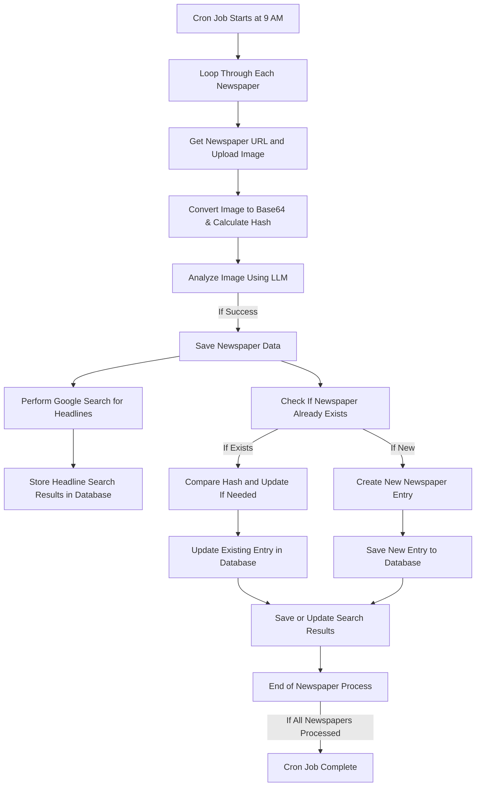

Lorem ipsum dolor sit amet, consectetur adipiscing elit, sed do eiusmod tempor incididunt ut labore et dolore magna aliqua. Ut enim ad minim veniam, quis nostrud exercitation ullamco laboris nisi ut aliquip ex ea commodo consequat. Duis aute irure dolor in reprehenderit in voluptate velit esse cillum dolore eu fugiat nulla pariatur. Excepteur sint occaecat cupidatat non proident, sunt in culpa qui officia deserunt mollit anim id est laborum.

> An apple is a sweet, edible fruit produced by an apple tree (Malus pumila). Apple trees are cultivated worldwide, and are the most widely grown species in the genus Malus. The tree originated in Central Asia, where its wild ancestor, Malus sieversii, is still found today. Apples have been grown for thousands of years in Asia and Europe, and were brought to North America by European colonists. Apples have religious and mythological significance in many cultures, including Norse, Greek and European Christian traditions.[^1]

---

Inline styles：

**strong**, *emphasis*, ***strong and emphasis***,`code`, <ins>underline</ins>[^2], ~~strikethrough~~, :joy:🤣, $\LaTeX$[^3], ==highlight==, [Link](https://example.com), and image:


Images can also be implemented via figure shortcode. It extends in-built hugo shortcode to convert images to webp format.

```go
{ {< figure src="images/928-600x400.jpg" alt="A WEBP converted image" caption="A WEBP converted image" class="webp" loading="lazy" >} }
```


---

Headings:

# Heading 1

## Heading 2

### Heading 3

#### Heading 4

##### Heading 5

###### Heading 6

Table:

| Left-Aligned  | Center Aligned  | Right Aligned |
| :------------ | :-------------: | ------------: |
| col 3 is      | some wordy text |         $1600 |
| col 2 is      |    centered     |           $12 |
| zebra stripes |    are neat     |            $1 |

Lists:

* Unordered list item 1.
* Unordered list item 2.

1. ordered list item 1.
2. ordered list item 2.
   + sub-unordered list item 1.
   + sub-unordered list item 2.
     + [x] something is DONE.
     + [ ] something is NOT DONE.

Syntax Highlighting without backticks:

    dt = {5:4, 1:6, 6:3}
    sorted_dt = {key: value for key, value in sorted(dt.items(), key=lambda item: item[1])}
    print(sorted_dt)

Syntax Highlighting with backticks:

```javascript
var num1, num2, sum
num1 = prompt("Enter first number")
num2 = prompt("Enter second number")
sum = parseInt(num1) + parseInt(num2) // "+" means "add"
alert("Sum = " + sum)  // "+" means combine into a string
```

Syntax Highlighting with [`highlight` shortcode](https://gohugo.io/content-management/syntax-highlighting/)


```go
{{/*< highlight css "linenos=table,linenostart=5" >*/}}
/* LineHighlight */ .chroma .hl { display: block; width: 100%;background-color: #55595ebb }
{{/*< /highlight >*/}}
```



/* LineHighlight */ .chroma .hl { display: block; width: 100%;background-color: #55595ebb }


Change Highlight color in `_syntax.scss` Line 5



html {
  background: $light-grey;
  line-height: 1.6;
  letter-spacing: .06em;
  scroll-behavior: smooth;
}

body,
button,
input,
select,
textarea {
  color: $text;
  font-family: $fonts;
}

pre,
code,
pre tt {
  font-family: $code-fonts;
}

pre {
  padding: .7em 1.1em;
  overflow: auto;
  font-size: .9em;
  line-height: 1.5;
  letter-spacing: normal;
  white-space: pre;
  color: #eee;
  background: $midnightblue;
  border-radius: 4px;
  // -webkit-overflow-scrolling: touch;

  code {
    padding: 0;
    margin: 0;
    background: $midnightblue;
  }
}

code {
  color: #eee;
  background: $highlight-grey;
  border-radius: 3px;
  padding: 0 3px;
  margin: 0 4px;
  word-wrap: break-word;
  letter-spacing: normal;
}

blockquote {
  border-left: .25em solid;
  margin: 1em;
  padding: 0 1em;
  font-style: italic;

  cite {
    font-weight: bold;
    font-style: normal;

    &::before {
      content: "—— ";
    }
  }
}



Mermaid support



[^1]: From https://en.wikipedia.org/wiki/Apple
[^2]: Hugo's default renderer (Goldmark) cannot render HTML tags by default and Markdown doesn't have underlines. To use HTML tags, use `[markup.goldmark.renderer] unsafe = true` in `hugo.toml`. Find it in [Staging Branch](https://github.com/1bl4z3r/hermit-V2/blob/5f0abfda179c86f39effbc36b291a53632c4caa8/hugo.toml#L74-L75)
[^3]: LaTeX is supported by Mathjax, explained [in this article]()